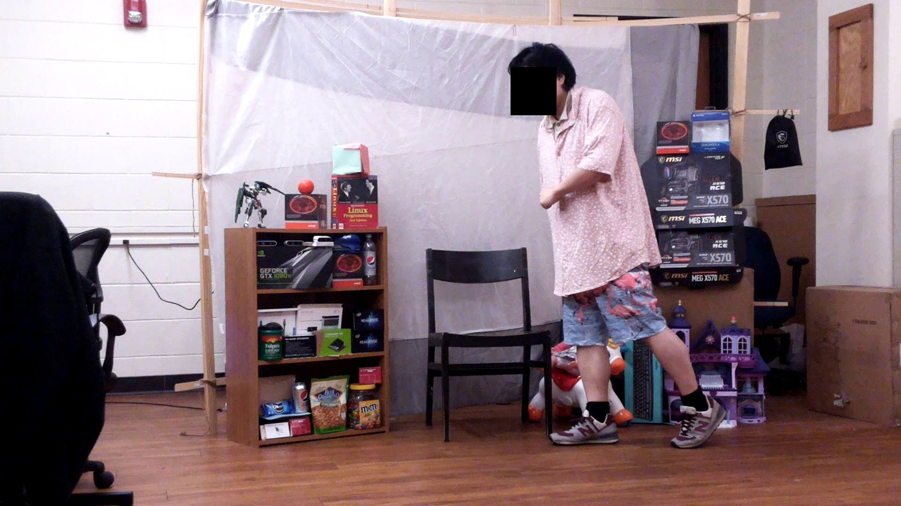
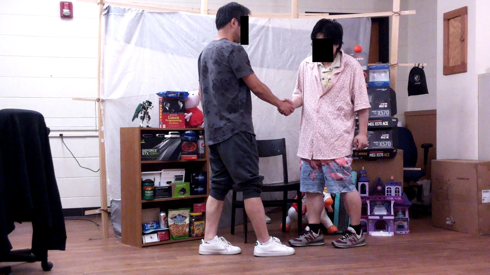
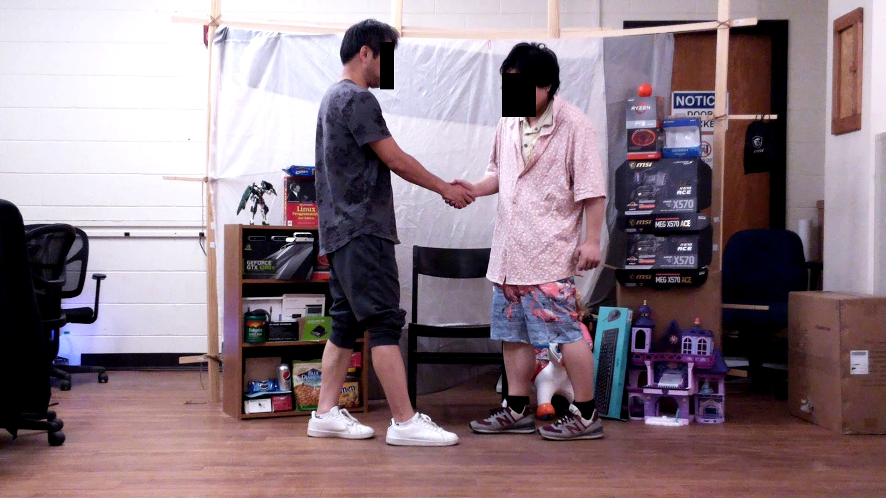
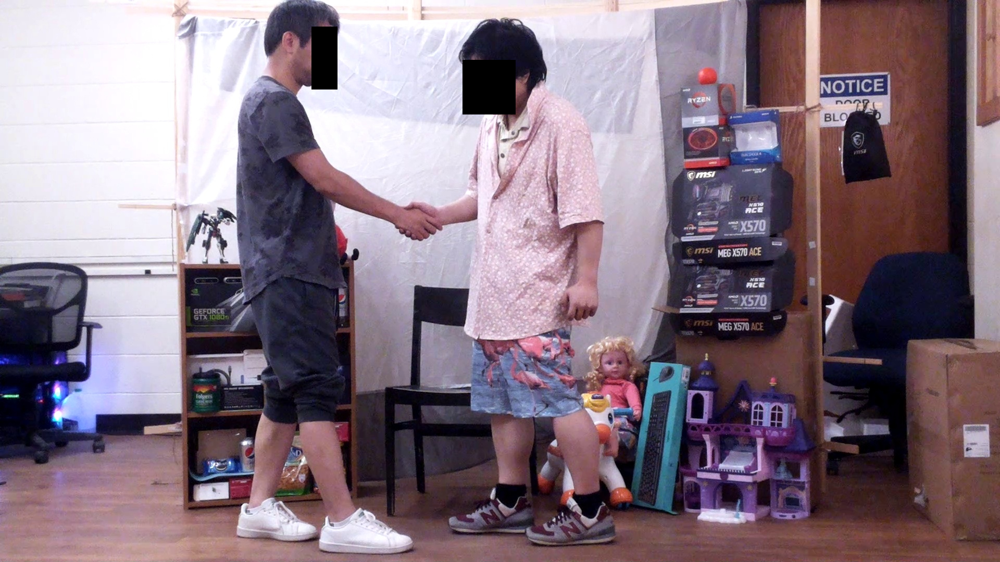

"""""""""""""""""""""""""""""""
Multi-view Datasets
"""""""""""""""""""""""""""""""
++++++++++++++++++++++++++++++++++
A 3D reconstruction dataset 
++++++++++++++++++++++++++++++++++

.. contents:: Overview
   :depth: 2

============
Introduction
============

The dataset is divided into 3 sub dataset: Walk, Handshake, Pickupbook.

The paper `On Balancing Latency and Quality of Multi-view 3D Reconstruction at the Edge`_ (Section III) describes the dataset and the methodology followed when collecting it in detail. Please cite it if you intend to use this dataset.

============
Sample Images
============

---------------
Walk samples
---------------
|walk_img1| |walk_img2| |walk_img3| |walk_img4| |walk_img5|

.. |walk_img1| image:: sample/walk/0.jpg
     :width: 19%

---------------
Handshake samples
---------------
|hand_img1| |hand_img2| |hand_img3| |hand_img4| |hand_img5|

.. |hand_img1| image:: sample/handshake/0.jpg
     :width: 19%

.. |hand_img3| image:: sample/handshake/2.jpg
     :width: 19%

---------------
Pickupbook samples
---------------
|pick_img1| |pick_img2| |pick_img3| |pick_img4| |pick_img5|

============
Reconstruction Results
============

---------------
Walk
---------------

---------------
Handshake
---------------

---------------
Pickupbook
---------------

============
Download
============

If you're going to use this dataset, please fill the `consent form`_ and we will send you the download link.

.. raw:: html

  
===============
Reference
===============

`On Balancing Latency and Quality of Multi-view 3D Reconstruction at the Edge`_, Xiaojie Zhang, Houchao Gan, Amitangshu Pal, Soumyabrata Dey, Saptarshi Debroy, 2023

`End-to-End Latency Optimization of Multi-view 3D Reconstruction for Disaster Response`_, Xiaojie Zhang, Mingjun Li, Andrew Hilton, Amitangshu Pal, Soumyabrata Dey, Saptarshi Debroy, 2022

.. 
  link for the paper 

.. _On Balancing Latency and Quality of Multi-view 3D Reconstruction at the Edge: https://www.google.com/
.. _End-to-End Latency Optimization of Multi-view 3D Reconstruction for Disaster Response : https://arxiv.org/pdf/2304.01488.pdf 

..
  link for the consent form
.. _consent form : https://forms.gle/yVuJUKZFbwJfjNhbA
